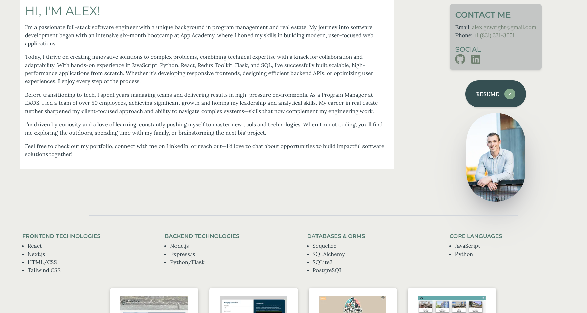

# Alex Wright — Portfolio

A personal portfolio site built with Next.js 15, React 19, Tailwind CSS, and Framer Motion. Showcases projects, technical skills, certifications, and contact info with animated glassmorphism UI and interactive project cards.

## Find Me

[Portfolio](https://www.alexwrightportfolio.com/) | [LinkedIn](https://www.linkedin.com/in/alexgwright2) | [GitHub](https://github.com/awright222)



## Tech Stack

- **Framework:** Next.js 15.1.6 (App Router, Turbopack)
- **UI:** React 19, Tailwind CSS 3.4
- **Animations:** Framer Motion
- **Icons:** Lucide React, React Icons
- **Font:** Geist (via `next/font`)

## Sections

- **Hero** — Animated particle background, profile photo, and role badges
- **About & Contact** — Bio, contact details, and downloadable resume
- **Technical Skills** — Frontend, backend, databases, and core languages
- **Certifications** — Professional certifications with detail modals
- **Featured Projects** — Interactive card grid with project modals (DealForge, Emberline, ThinkDeck, Formulate Tests, Guide Finder, Mortgage Calculator, Lovely Paws, Migration Station)

## Getting Started

```bash
npm install
npm run dev
```

Open [http://localhost:3000](http://localhost:3000) to view the site.

## Build & Deploy

```bash
npm run build
npm start
```

Deployed on [Vercel](https://vercel.com).
